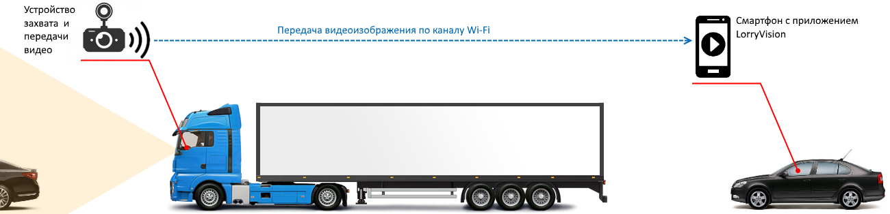

# LorryVision 
New branch of LV development with updated tools.

## Описание проекта LorryVision
Система предназначена для повышения безопасности на дороге при обгоне крупногабаритного транспорта (фуры).
На фуру устанавливается видеорегистратор, захватывающий изображение обстановки перед ней и создающий Wi-Fi
сеть, по которой транслируется видеоизображение.

Приложение LorryVision устанавливается на смартфон водителя автомобиля, который собирается обгонять фуру. Оно предназначено
для автоматического подключения к сети Wi-Fi видеорегистратора и выведения трансляции на экран. Таким образом, водитель,
не отвлекаясь от управления автомобилем, по принятому видеоизображению сможет оценить обстановку перед фурой
и принять решение об обгоне.

Скриншоты приложения

